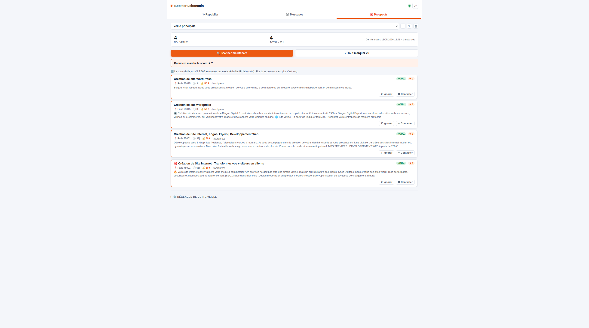
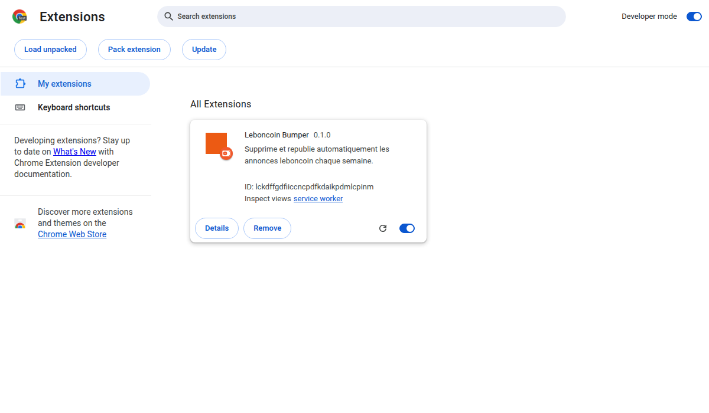
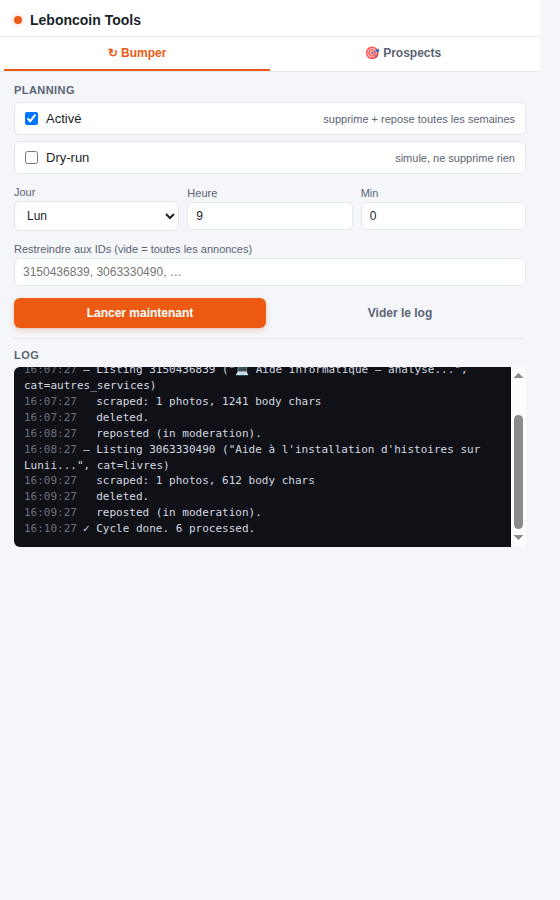

# Leboncoin Bumper

> Extension Chrome (Manifest V3) qui **republie automatiquement tes annonces leboncoin** chaque semaine et **scrute les demandes tech** correspondant à tes compétences.

<p align="center">
  
</p>

[](#tests)
[](LICENSE)
[](manifest.json)

🇬🇧 **English version** below ([#english](#english))

---

## Pourquoi

Sur leboncoin, tes annonces coulent dans les résultats de recherche au bout de quelques jours. Le seul moyen gratuit de remonter en haut, c'est de **supprimer puis republier**. À la main, sur 5–10 annonces chaque semaine, c'est pénible.

Cette extension le fait pour toi, sur un planning hebdomadaire, **100 % local, sans service tiers**. En bonus, elle scrute aussi leboncoin pour repérer les **demandes tech récentes** auxquelles tu pourrais répondre (recherche de développeur, aide WordPress, automatisation, retrogaming…).

## Fonctionnalités

### ↻ Bumper

- **Récupère tes annonces actives** (titre, description, prix, localité, photos)
- **Les supprime** via le formulaire de confirmation leboncoin
- **Les republie à l'identique** via le wizard de dépôt (catégorie auto-matchée, photos ré-uploadées, préférence "numéro masqué" préservée)
- **Planning hebdomadaire** via `chrome.alarms`
- **Mode dry-run** pour prévisualiser sans rien toucher
- **Filtre par IDs d'annonces** pour tester sur un sous-ensemble d'abord

### 🎯 Prospect Watch

- Appelle directement l'**API `/finder/search`** de leboncoin (un POST par mot-clé)
- **62 mots-clés tech par défaut** taillés pour un profil full-stack français, entièrement éditables
- **Moteur de scoring** avec regex de signaux forts/modérés/négatifs — élimine jardiniers, ménages, colocations ; garde WordPress, Symfony, N8N, IA…
- **Filtre fraîcheur `<30 jours`**
- **Dédoublonnage avec `seenIds`** — une fois une annonce vue, elle reste dans la liste mais perd le badge orange `NEW`
- **Planning hebdomadaire** indépendant du bumper
- **Click-through** pour ouvrir l'annonce dans un nouvel onglet

## Installation

> L'extension n'est pas sur le Chrome Web Store. Installe-la en mode développeur.

```bash
git clone https://github.com/ohugonnot/leboncoin-bumper.git
```

1. Ouvre `chrome://extensions` dans Chrome
2. Active le **Mode développeur** (interrupteur en haut à droite)
3. Clique **Charger l'extension non empaquetée** et sélectionne le dossier `leboncoin-bumper/`
4. Épingle l'icône orange à ta barre d'outils

<p align="center">
  
</p>

Assure-toi d'être **connecté à leboncoin.fr** dans le même profil Chrome avant d'utiliser le bumper.

## Utilisation

### Bumper

<p align="center">
  
</p>

1. Ouvre le popup, onglet **↻ Bumper**.
2. **Laisse "Dry-run" coché** pour le premier essai. Tu peux mettre un seul ID d'annonce dans **"Restreindre aux IDs"** pour tester sur une annonce précise.
3. Clique **Lancer maintenant**. Surveille le log — tu devrais voir `Found N listing(s).` puis `scraped: …` puis `[dry-run] would delete + repost.`
4. Si le dry-run a l'air bon, **décoche Dry-run**, coche **Activé**, choisis Jour/Heure, laisse le champ IDs vide (= bump toutes les annonces). Le prochain bump aura lieu à l'heure choisie et se répétera tous les 7 jours.

### Prospect Watch

1. Ouvre le popup, onglet **🎯 Prospects**.
2. Clique **Scanner maintenant**. ~30–60 s pour 62 mots-clés.
3. Lis les cards (les plus pertinentes en premier). Clique sur un titre pour ouvrir l'annonce dans un nouvel onglet.
4. Clique **Marquer toutes comme vues** une fois que tu as traité les résultats — le scan suivant ne mettra en avant que ce qui est vraiment nouveau.
5. Active **Veille hebdo activée** si tu veux que le scan tourne tout seul chaque semaine.

### Personnaliser les mots-clés

La liste par défaut est calibrée pour un dev full-stack français. Édite le textarea dans l'onglet **Prospects** (un mot-clé par ligne) pour matcher ta niche.

## Configuration

Tout l'état vit dans `chrome.storage.local`. Le popup expose :

| Onglet | Réglage | Effet |
|---|---|---|
| Bumper | `enabled` | Lance le cycle de bump à l'heure planifiée |
| Bumper | `dryRun` | Scrape uniquement ; ne supprime / republie jamais |
| Bumper | `dayOfWeek`/`hour`/`minute` | Quand déclencher |
| Bumper | `onlyAdIds` | Liste blanche d'IDs ; vide = toutes les annonces |
| Prospects | `enabled` | Lance le scan à l'heure planifiée |
| Prospects | `dayOfWeek`/`hour` | Quand déclencher |
| Prospects | `minScore` | Élimine les annonces sous ce score (défaut : 5) |
| Prospects | `maxAgeDays` | Élimine les annonces plus vieilles que (défaut : 30) |
| Prospects | `keywords` | Un mot-clé par ligne |

## Comment ça marche

```
┌────────────────┐    ┌──────────────────┐    ┌─────────────────────┐
│ chrome.alarms  │───►│  background.js   │───►│  orchestrator.js    │
│ (hebdomadaire) │    │  (service worker)│    │  scrape → delete →  │
└────────────────┘    └──────────────────┘    │  repost (via onglet)│
                              │                └─────────────────────┘
                              │                ┌─────────────────────┐
                              └───────────────►│  prospect.js        │
                                               │  API /finder/search │
                                               │  scoring + dédup    │
                                               └─────────────────────┘
```

- Le **Bumper** (`orchestrator.js`) pilote un vrai onglet Chrome à travers l'interface leboncoin. Il reproduit ce que tu cliquerais toi-même : carte → bouton "Supprimer" → `button-delete-confirm` → wizard de dépôt. Tous les sélecteurs sont reverse-engineerés depuis le DOM live.
- **Prospect Watch** (`prospect.js`) appelle la même API que le front leboncoin utilise (`POST https://api.leboncoin.fr/finder/search`) avec `ad_type=demand`. L'`api_key` est la clé publique du client web visible dans toutes les requêtes navigateur.

## Tests

La logique pure (scoring + dédoublonnage) est couverte par le test runner Node natif — pas de dépendance.

```bash
npm test
# ou
node --test tests/
```

18 tests, ~120 ms. Couvre les régressions regex (ex : "vue" tout court ne doit pas matcher le framework JS), le comportement `seenIds`, le filtre d'âge, et le dédoublonnage à travers les mots-clés.

## ⚠️ Limitations & avertissement

- **Les CGU de leboncoin interdisent l'automatisation** (art. 8 — usage de robot, script…). Utiliser cette extension peut faire flagger ou suspendre ton compte. Si tu es prudent·e, teste d'abord sur un compte secondaire.
- Le bumper dépend du DOM/HTML de leboncoin. Quand ils redesignent une page, des sélecteurs cassent. Ouvre une issue ou envoie une PR — les correctifs sont typiquement 5 lignes de locator.
- La première étape du wizard de dépôt affiche parfois un écran supplémentaire "Type d'annonce" (Offre/Demande) selon la catégorie auto-détectée. L'orchestrateur la saute quand elle n'est pas présente.
- DataDome (l'anti-bot de leboncoin) tolère un usage modéré dans une vraie session utilisateur. Ne descends pas le planning sous "quotidien".

Ce projet n'est **pas affilié à leboncoin.fr**. Il est fourni "tel quel" sous licence MIT — voir [LICENSE](LICENSE).

## Roadmap

- [ ] Sélecteur visuel pour "Restreindre aux IDs" (liste des annonces avec checkboxes)
- [ ] Statut par annonce (✓ buméée / ⏸ skipped / ✗ failed) dans un dashboard
- [ ] Historique persistant des derniers cycles
- [ ] Micro-randomisation optionnelle des horaires de repost pour un aspect plus naturel
- [ ] Ouvrir le corps d'un prospect inline (sans quitter le popup)

## Contribuer

PRs bienvenues — voir [CONTRIBUTING.md](CONTRIBUTING.md). Les correctifs de sélecteurs après un redesign leboncoin sont la contribution la plus précieuse.

## Crédits

Construit par [Odilon Hugonnot](https://www.web-developpeur.com) — dev full-stack/backend (PHP/Symfony/Go), Besançon.

---

<a id="english"></a>
## English

Chrome MV3 extension that auto-bumps your leboncoin listings every week and watches for tech demands matching your skills.

**Quick start:**

```bash
git clone https://github.com/ohugonnot/leboncoin-bumper.git
```

Then `chrome://extensions` → enable Developer mode → "Load unpacked" → select the cloned folder.

The full docs are in French above — the codebase, identifiers and inline JSDoc are in English, so contributing is language-neutral.

This project automates user actions on a third-party site (leboncoin.fr) which is against their Terms of Service. Use at your own risk on personal accounts. See the [disclaimer in LICENSE](LICENSE).
